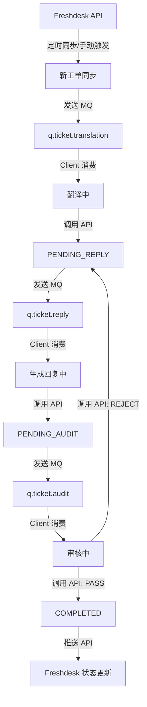

# FD-AutoPilot 系统详细设计文档

## 1. 项目背景
FD-AutoPilot 系统旨在通过自动化手段提升工单处理效率。系统结合了 AI 翻译、回复生成及人工审核流程，通过服务端与客户端的协同工作实现闭环。

---

## 2. 系统架构
系统由以下两部分组成：
- **fd-server (Java)**: 中央服务端，负责工单持久化、状态流转及任务分发（通过 RabbitMQ）。
- **fd-client**: 客户端，消费 MQ 任务，执行具体业务逻辑（如调用 AI 接口进行翻译/回复），并通过 API 向服务端上报结果。

---

## 3. Freshdesk 集成设计

服务端 `fd-server` 负责与 Freshdesk API 进行对接，实现工单的增量同步。

### 3.1 认证与配置
系统使用 API Key (Access Key) 进行身份验证，通过 HTTP Basic Auth 发送请求。
- **配置项**:
    - `freshdesk.domain`: 实例域名 (例如 `yourcompany.freshdesk.com`)
    - `freshdesk.api-key`: 获取自 Freshdesk 个人设置的 API 密钥
    - `freshdesk.sync.cron`: 工单同步任务的执行周期 (如 `0 0/5 * * * ?` 每5分钟同步一次)

### 3.2 同步机制
1. **获取工单**: 调用 `GET /api/v2/tickets` 接口。
2. **增量策略**: 记录上一次成功同步的最大更新时间 `last_updated_at`，并在下一次同步时携带 `updated_since` 参数，仅获取该时间点之后修改的工单。
3. **分发任务**:
    - 若为新工单且状态为 `Open`，则在数据库创建记录，并将状态初始化为 `PENDING_TRANS`。
    - 记录创建后，服务端立即向 RabbitMQ `q.ticket.translation` 队列发送任务消息，正式启动处理流。

---

## 4. 数据库设计 (Database Design)

使用 H2 数据库进行持久化，以下是详细的表结构设计。

### 4.1 工单主表 (`ticket`)
| 字段名        | 类型          | 约束             | 说明                                                                                                  |
| :------------ | :------------ | :--------------- | :---------------------------------------------------------------------------------------------------- |
| `id`          | `BIGINT`      | PK, Auto Inc     | 内部唯一 ID                                                                                           |
| `external_id` | `VARCHAR(64)` | Unique, Not Null | 外部系统原始 ID                                                                                       |
| `subject`     | `TEXT`        | -                | 工单标题                                                                                              |
| `content`     | `LONGTEXT`    | -                | 工单原始正文                                                                                          |
| `source_lang` | `VARCHAR(16)` | -                | 工单原始语言                                                                                          |
| `status`      | `VARCHAR(32)` | Index            | `PENDING_TRANS`, `TRANSLATING`, `PENDING_REPLY`, `REPLYING`, `PENDING_AUDIT`, `AUDITING`, `COMPLETED` |
| `created_at`  | `TIMESTAMP`   | Default Now      | 系统接收时间                                                                                          |
| `updated_at`  | `TIMESTAMP`   | -                | 最后更新时间                                                                                          |
| `is_valid`    | `BOOLEAN`     | Default False    | 是否为有效工单 (用于知识库沉淀)                                                                       |

### 4.2 翻译明细表 (`ticket_translation`)
| 字段名               | 类型          | 约束           | 说明                |
| :------------------- | :------------ | :------------- | :------------------ |
| `id`                 | `BIGINT`      | PK, Auto Inc   | 主键                |
| `ticket_id`          | `BIGINT`      | FK (ticket.id) | 关联工单            |
| `target_lang`        | `VARCHAR(16)` | -              | 目标语言 (如 zh-CN) |
| `translated_title`   | `TEXT`        | -              | 标题翻译            |
| `translated_content` | `LONGTEXT`    | -              | 正文翻译            |
| `created_at`         | `TIMESTAMP`   | Default Now    | 翻译时间            |

### 4.3 回复建议表 (`ticket_reply`)
| 字段名         | 类型          | 约束           | 说明                      |
| :------------- | :------------ | :------------- | :------------------------ |
| `id`           | `BIGINT`      | PK, Auto Inc   | 主键                      |
| `ticket_id`    | `BIGINT`      | FK (ticket.id) | 关联工单                  |
| `reply_lang`   | `VARCHAR(16)` | -              | 客户语言回复              |
| `zh_reply`     | `LONGTEXT`    | -              | 中文对照回复 (供审核参考) |
| `target_reply` | `LONGTEXT`    | -              | 目标语言回复              |
| `is_selected`  | `BOOLEAN`     | Default False  | 是否被最终采用            |
| `created_at`   | `TIMESTAMP`   | Default Now    | 生成时间                  |

### 4.4 审核历史表 (`ticket_audit`)
| 字段名         | 类型          | 约束                 | 说明                           |
| :------------- | :------------ | :------------------- | :----------------------------- |
| `id`           | `BIGINT`      | PK, Auto Inc         | 主键                           |
| `ticket_id`    | `BIGINT`      | FK (ticket.id)       | 关联工单                       |
| `reply_id`     | `BIGINT`      | FK (ticket_reply.id) | 关联回复内容                   |
| `audit_result` | `VARCHAR(16)` | -                    | `PASS` (通过), `REJECT` (驳回) |
| `audit_remark` | `TEXT`        | -                    | 审核意见                       |
| `auditor_id`   | `BIGINT`      | FK (sys_user.id)     | 审核人 ID                      |
| `created_at`   | `TIMESTAMP`   | Default Now          | 审核执行时间                   |

### 4.5 用户表 (`sys_user`)
| 字段名       | 类型           | 约束             | 说明                                         |
| :----------- | :------------- | :--------------- | :------------------------------------------- |
| `id`         | `BIGINT`       | PK, Auto Inc     | 用户 ID                                      |
| `username`   | `VARCHAR(64)`  | Unique, Not Null | 用户名                                       |
| `password`   | `VARCHAR(128)` | Not Null         | 加密后的密码                                 |
| `role`       | `VARCHAR(32)`  | -                | 角色 (`ADMIN`/`USER`)                        |
| `status`     | `VARCHAR(32)`  | -                | 用户状态 (`PENDING`, `APPROVED`, `REJECTED`) |
| `created_at` | `TIMESTAMP`    | Default Now      | 创建时间                                     |

---

## 5. API 设计 (API Design)

所有接口前缀建议使用 `/api/v1`。

### 5.1 工单查询 (Client 轮询或展示)
- **Method**: `GET /api/v1/tickets`
- **Params**:
    - `status` (Optional): 过滤状态 (`PENDING_TRANS`, `COMPLETED` 等)
    - `external_id` (Optional): 外部系统原始 ID 精确匹配
    - `subject` (Optional): 标题关键词模糊匹配
    - `is_valid` (Optional): 是否为有效工单 (`true`/`false`)
    - `created_after` / `created_before` (Optional): 创建时间范围过滤 (ISO8601 格式)
    - `page`, `size`: 分页参数 (默认 `page=0, size=20`)
- **Response**: `List<TicketDTO>` (包含 ID, 标题, 状态, 是否有效及其关联的翻译和回复数据快照)

### 5.2 上报翻译结果
- **Method**: `POST /api/v1/tickets/{id}/translation`
- **Body**:
    ```json
    {
      "targetLang": "zh-CN",
      "translatedTitle": "翻译后的标题",
      "translatedContent": "翻译后的正文"
    }
    ```
- **Logic**: 更新工单状态为 `PENDING_REPLY`，记录翻译数据。

### 5.3 上报回复内容
- **Method**: `POST /api/v1/tickets/{id}/reply`
- **Body**:
    ```json
    {
      "zhReply": "请耐心等待，我们正在处理...",
      "targetReply": "Please wait patiently, we are processing..."
    }
    ```
- **Logic**: 更新工单状态为 `PENDING_AUDIT`，保存回复建议。

### 5.4 上报审核结果
- **Method**: `POST /api/v1/tickets/{id}/audit`
- **Body**:
    ```json
    {
      "replyId": 123,
      "auditResult": "PASS",
      "auditRemark": "回复得很专业"
    }
    ```
- **Logic**: 
    - 若 `PASS`: 更新工单状态为 `COMPLETED`，并**同步调用** Freshdesk Reply API 推送回复内容。
    - 若 `REJECT`: 更新工单状态回 `PENDING_REPLY` (触发重新回复) 或标记异常。

### 5.5 Freshdesk 手动同步 (Admin 专用)
- **Method**: `POST /api/v1/sync/freshdesk`
- **Logic**: 立即触发一次增量同步流程。
- **Response**: 返回同步任务的摘要信息（如同步到的工单数量）。

### 5.6 标记工单有效性
- **Method**: `POST /api/v1/tickets/{id}/valid`
- **Body**:
    ```json
    {
      "isValid": true
    }
    ```
- **Logic**: 更新工单的 `is_valid` 状态，便于后期提取高质量回复存入知识库。

### 5.7 用户登录
- **Method**: `POST /api/v1/auth/login`
- **Body**:
    ```json
    {
      "username": "admin",
      "password": "password123"
    }
    ```
- **Response**:
    ```json
    {
      "token": "eyJhbGciOiJIUzI1NiIsInR5cCI6IkpXVCJ9...",
      "expireAt": 1672531200000
    }
    ```
- **Logic**: 验证用户信息，签发 JWT。
- **失败响应** (401 Unauthorized):
    ```json
    {
      "error": "INVALID_CREDENTIALS",
      "message": "用户名或密码错误"
    }
    ```

### 5.8 用户注册
- **Method**: `POST /api/v1/auth/register`
- **Body**:
    ```json
    {
      "username": "newuser",
      "password": "securepassword"
    }
    ```
- **Logic**: 创建用户记录，初始状态设为 `PENDING`。

### 5.9 查询待审核用户 (Admin 专用)
- **Method**: `GET /api/v1/admin/users/pending`
- **Logic**: 列表展示所有 `PENDING` 状态的用户申请。

### 4.10 审核用户 (Admin 专用)
- **Method**: `POST /api/v1/admin/users/{id}/approve`
- **Body**: `{ "action": "APPROVE" | "REJECT" }`
- **Logic**: 更新用户状态。只有 `APPROVED` 用户方可登录。

---

## 6. RabbitMQ 消息队列设计 (MQ Design)

### 6.1 交换机 (Exchange)
- **Name**: `fd.ticket.task.exchange`
- **Type**: `topic`

### 6.2 队列 (Queue) 与 路由 (Routing Key)
1. **翻译任务队列**:
    - **Queue**: `q.ticket.translation`
    - **Routing Key**: `ticket.task.translate`
2. **回复任务队列**:
    - **Queue**: `q.ticket.reply`
    - **Routing Key**: `ticket.task.reply`
3. **审核任务队列**:
    - **Queue**: `q.ticket.audit`
    - **Routing Key**: `ticket.task.audit`

### 6.3 消息格式示例
```json
{
  "msgId": "uuid-12345",
  "ticketId": 1001,
  "timestamp": 1672531200000,
  "payload": {
    "externalId": "EXT-99",
    "subject": "System down",
    "content": "Full logs appended..."
  }
}
```

### 6.4 错误处理与重试机制 [NEW]
- **重试策略**: 消费失败后最多重试 3 次，每次间隔指数退避（初始 1s）。
- **死信队列 (DLQ)**: 重试耗尽后，消息转入 `q.ticket.dlq`，待人工干预。

---

## 7. 安全与授权 (Security & Authorization)

系统采用典型的无状态认证架构：

### 7.1 身份验证 (Authentication)
- 基于 **JWT (JSON Web Token)**。
- `fd-client` 登录成功后获取 Token，需在后续请求的 HTTP Header 中携带：`Authorization: Bearer <token>`。
- 服务端校验 Token 签名及有效期。

### 7.2 权限控制 (Authorization)
- **角色映射**: 
    - `ADMIN`: 全量权限（同步触发、用户审批、标记有效性、系统配置）。
    - `USER`: 业务权限（工单查询、翻译/回复上报）。
- **拦截器**: 统一拦截器处理 Token 校验，白名单接口（如登录、注册）除外。

### 7.3 角色权限矩阵

| 功能模块       | API 接口                           | ADMIN | USER  | 备注            |
| :------------- | :--------------------------------- | :---: | :---: | :-------------- |
| 用户登录       | `POST /api/v1/auth/login`          |   √   |   √   | 无需 Token      |
| 用户注册       | `POST /api/v1/auth/register`       |   √   |   √   | 无需 Token      |
| 用户审批       | `POST /api/v1/admin/users/approve` |   √   |   -   | 管理员专属      |
| Freshdesk 同步 | `POST /api/v1/sync/freshdesk`      |   √   |   -   | 管理员专属      |
| 标记有效工单   | `POST /api/v1/tickets/{id}/valid`  |   √   |   -   | 管理员/专家专属 |
| 工单查询/处理  | `GET /api/v1/tickets` 等           |   √   |   √   | 基础业务流      |

---

## 8. 配置项清单 (Configuration) [NEW]

以下为系统部署时需要配置的关键参数：

| 配置项                 | 说明                 | 示例                        |
| :--------------------- | :------------------- | :-------------------------- |
| `freshdesk.domain`     | Freshdesk 实例域名   | `yourcompany.freshdesk.com` |
| `freshdesk.api-key`    | Freshdesk API 密钥   | `abcdefgh12345678`          |
| `freshdesk.sync.cron`  | 同步周期 Cron 表达式 | `0 0/5 * * * ?`             |
| `jwt.secret`           | JWT 签名密钥         | `my-256-bit-secret`         |
| `jwt.expiration-hours` | JWT 有效期 (小时)    | `24`                        |
| `rabbitmq.host`        | RabbitMQ 连接地址    | `localhost`                 |
| `rabbitmq.port`        | RabbitMQ 端口        | `5672`                      |
| `rabbitmq.username`    | RabbitMQ 用户名      | `guest`                     |
| `rabbitmq.password`    | RabbitMQ 密码        | `guest`                     |

---

## 9. 状态流转图

