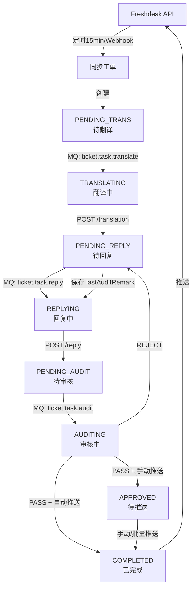

# FD-AutoPilot 系统详细设计文档

## 1. 项目背景
FD-AutoPilot 系统旨在通过自动化手段提升工单处理效率。系统结合了 AI 翻译、回复生成及人工审核流程，通过服务端与客户端的协同工作实现闭环。

---

## 2. 系统架构
系统由以下两部分组成：
- **fd-server (Java)**: 中央服务端，负责工单持久化、状态流转及任务分发（通过 RabbitMQ）。
- **fd-client**: 客户端，消费 MQ 任务，执行具体业务逻辑（如调用 AI 接口进行翻译/回复），并通过 API 向服务端上报结果。

---

## 3. Freshdesk 集成设计

服务端 `fd-server` 负责与 Freshdesk API 进行对接，实现工单的增量同步。

### 3.1 认证与配置
系统使用 API Key (Access Key) 进行身份验证，通过 HTTP Basic Auth 发送请求。
- **配置项**:
    - `freshdesk.domain`: 实例域名 (例如 `yourcompany.freshdesk.com`)
    - `freshdesk.api-key`: 获取自 Freshdesk 个人设置的 API 密钥
    - `freshdesk.sync.cron`: 工单同步任务的执行周期 (如 `0 0/15 * * * ?` 每15分钟同步一次)

### 3.2 同步机制
1. **获取工单**: 调用 `GET /api/v2/tickets` 接口。
2. **增量策略**: 记录上一次成功同步的最大更新时间 `last_updated_at`，并在下一次同步时携带 `updated_since` 参数，仅获取该时间点之后修改的工单。
3. **分发任务**:
    - 若为新工单且状态为 `Open`，则在数据库创建记录，并将状态初始化为 `PENDING_TRANS`。
    - 记录创建后，服务端立即向 RabbitMQ `q.ticket.translation` 队列发送任务消息，正式启动处理流。

---

## 4. 数据库设计 (Database Design)

使用 H2 数据库进行持久化，以下是详细的表结构设计。

### 4.1 工单主表 (`ticket`)
| 字段名             | 类型          | 约束             | 说明                                                                                                  |
| :----------        | :------------ | :--------------- | :---------------------------------------------------------------------------------------------------- |
| `id`               | `BIGINT`      | PK, Auto Inc     | 内部唯一 ID                                                                                           |
| `external_id`      | `VARCHAR(64)` | Unique, Not Null | 外部系统原始 ID（Freshdesk Ticket ID）                                                                |
| `subject`          | `LONGTEXT`    | -                | 工单标题                                                                                              |
| `content`          | `LONGTEXT`    | -                | 工单原始正文                                                                                          |
| `source_lang`      | `VARCHAR(16)` | -                | 工单原始语言                                                                                          |
| `status`           | `VARCHAR(32)` | Index            | `PENDING_TRANS`, `TRANSLATING`, `PENDING_REPLY`, `REPLYING`, `PENDING_AUDIT`, `AUDITING`, `APPROVED`, `COMPLETED` |
| `created_at`       | `TIMESTAMP`   | Default Now      | 系统接收时间                                                                                          |
| `updated_at`       | `TIMESTAMP`   | -                | 最后更新时间                                                                                          |
| `is_valid`         | `BOOLEAN`     | Default False    | 是否为有效工单 (用于知识库沉淀)                                                                       |
| `last_audit_remark`| `LONGTEXT`    | -                | 最近一次审核驳回意见（注入 AI 回复提示词）                                                            |
| `fd_status`        | `INTEGER`     | -                | Freshdesk 工单状态 ID                                                                                 |
| `fd_priority`      | `INTEGER`     | -                | Freshdesk 优先级 ID                                                                                   |
| `fd_source`        | `INTEGER`     | -                | Freshdesk 来源 ID                                                                                     |
| `fd_type`          | `VARCHAR(64)` | -                | Freshdesk 工单类型                                                                                    |
| `fd_requester_id`  | `BIGINT`      | -                | Freshdesk 提交人 ID                                                                                   |
| `fd_responder_id`  | `BIGINT`      | -                | Freshdesk 响应人 ID                                                                                   |
| `fd_group_id`      | `BIGINT`      | -                | Freshdesk 组别 ID                                                                                     |
| `fd_tags`          | `VARCHAR(512)`| -                | Freshdesk 标签（逗号分隔）                                                                            |
| `fd_created_at`    | `TIMESTAMP`   | -                | Freshdesk 工单创建时间                                                                                |
| `fd_updated_at`    | `TIMESTAMP`   | -                | Freshdesk 工单最后更新时间                                                                            |
| `content_hash`     | `VARCHAR(64)` | -                | 内容哈希，用于检测工单是否变更                                                                        |
| `last_synced_at`   | `TIMESTAMP`   | -                | 最后同步时间                                                                                          |
| `sync_source`      | `VARCHAR(16)` | -                | 同步来源（`SCHEDULED`/`WEBHOOK`/`MANUAL`）                                                           |

### 4.2 翻译明细表 (`ticket_translation`)
| 字段名               | 类型          | 约束           | 说明                |
| :------------------- | :------------ | :------------- | :------------------ |
| `id`                 | `BIGINT`      | PK, Auto Inc   | 主键                |
| `ticket_id`          | `BIGINT`      | FK (ticket.id) | 关联工单            |
| `target_lang`        | `VARCHAR(16)` | -              | 目标语言 (如 zh-CN) |
| `translated_title`   | `TEXT`        | -              | 标题翻译            |
| `translated_content` | `LONGTEXT`    | -              | 正文翻译            |
| `created_at`         | `TIMESTAMP`   | Default Now    | 翻译时间            |

### 4.3 回复建议表 (`ticket_reply`)
| 字段名         | 类型          | 约束           | 说明                      |
| :------------- | :------------ | :------------- | :------------------------ |
| `id`           | `BIGINT`      | PK, Auto Inc   | 主键                      |
| `ticket_id`    | `BIGINT`      | FK (ticket.id) | 关联工单                  |
| `reply_lang`   | `VARCHAR(16)` | -              | 客户语言回复              |
| `zh_reply`     | `LONGTEXT`    | -              | 中文对照回复 (供审核参考) |
| `target_reply` | `LONGTEXT`    | -              | 目标语言回复              |
| `is_selected`  | `BOOLEAN`     | Default False  | 是否被最终采用            |
| `created_at`   | `TIMESTAMP`   | Default Now    | 生成时间                  |

### 4.4 审核历史表 (`ticket_audit`)
| 字段名         | 类型          | 约束                 | 说明                           |
| :------------- | :------------ | :------------------- | :----------------------------- |
| `id`           | `BIGINT`      | PK, Auto Inc         | 主键                           |
| `ticket_id`    | `BIGINT`      | FK (ticket.id)       | 关联工单                       |
| `reply_id`     | `BIGINT`      | FK (ticket_reply.id) | 关联回复内容                   |
| `audit_result` | `VARCHAR(16)` | -                    | `PASS` (通过), `REJECT` (驳回) |
| `audit_remark` | `TEXT`        | -                    | 审核意见                       |
| `auditor_id`   | `BIGINT`      | FK (sys_user.id)     | 审核人 ID                      |
| `created_at`   | `TIMESTAMP`   | Default Now          | 审核执行时间                   |

### 4.5 用户表 (`sys_user`)
| 字段名       | 类型           | 约束             | 说明                                         |
| :----------- | :------------- | :--------------- | :------------------------------------------- |
| `id`         | `BIGINT`       | PK, Auto Inc     | 用户 ID                                      |
| `username`   | `VARCHAR(64)`  | Unique, Not Null | 用户名                                       |
| `password`   | `VARCHAR(128)` | Not Null         | 加密后的密码                                 |
| `role`       | `VARCHAR(32)`  | -                | 角色 (`ADMIN`/`USER`)                        |
| `status`     | `VARCHAR(32)`  | -                | 用户状态 (`PENDING`, `APPROVED`, `REJECTED`) |
| `created_at` | `TIMESTAMP`    | Default Now      | 创建时间                                     |

### 4.6 知识库注意事项表 (`knowledge_note`)
| 字段名       | 类型          | 约束         | 说明         |
| :----------- | :------------ | :----------- | :----------- |
| `id`         | `BIGINT`      | PK, Auto Inc | 主键         |
| `title`      | `VARCHAR(200)`| Not Null     | 注意事项标题 |
| `content`    | `LONGTEXT`    | Not Null     | 注意事项内容 |
| `sort_order` | `INTEGER`     | -            | 排序顺序     |
| `created_at` | `TIMESTAMP`   | Default Now  | 创建时间     |
| `updated_at` | `TIMESTAMP`   | -            | 更新时间     |

### 4.7 同步日志表 (`sync_log`)
| 字段名            | 类型           | 约束         | 说明                                                       |
| :------------     | :------------- | :----------- | :--------------------------------------------------------- |
| `id`              | `BIGINT`       | PK, Auto Inc | 主键                                                       |
| `start_time`      | `TIMESTAMP`    | Not Null     | 同步开始时间                                               |
| `end_time`        | `TIMESTAMP`    | -            | 同步完成时间                                               |
| `tickets_synced`  | `INTEGER`      | -            | 本次同步新增工单数                                         |
| `tickets_updated` | `INTEGER`      | -            | 本次同步更新工单数                                         |
| `status`          | `VARCHAR(16)`  | -            | 同步状态 (`RUNNING`, `SUCCESS`, `FAILED`)                  |
| `trigger_type`    | `VARCHAR(16)`  | -            | 触发类型 (`SCHEDULED`, `MANUAL`, `WEBHOOK`)                |
| `error_message`   | `VARCHAR(1024)`| -            | 错误信息（仅当 status=FAILED 时填充）                      |

### 4.8 同步配置表 (`sync_config`)
| 字段名        | 类型          | 约束                    | 说明                      |
| :------------ | :------------ | :---------------------- | :------------------------ |
| `id`          | `BIGINT`      | PK, Auto Inc            | 主键                      |
| `config_key`  | `VARCHAR(64)` | Unique, Not Null        | 配置键（见常量定义）      |
| `config_value`| `VARCHAR(512)`| -                       | 配置值                    |
| `description` | `VARCHAR(256)`| -                       | 配置描述                  |
| `updated_at`  | `TIMESTAMP`   | -                       | 最后更新时间              |

**配置键常量**（`SyncConfig` 类中定义）：
- `freshdesk_sync_cron` — Cron 表达式（默认 `0 0/15 * * * ?`）
- `freshdesk_last_sync_time` — 上次同步时间戳
- `freshdesk_sync_enabled` — 是否启用同步（true/false）

### 4.9 推送失败重试表 (`failed_reply_push`)
| 字段名          | 类型           | 约束         | 说明                                           |
| :-------------- | :------------- | :----------- | :--------------------------------------------- |
| `id`            | `BIGINT`       | PK, Auto Inc | 主键                                           |
| `ticket_id`     | `BIGINT`       | Not Null     | 关联工单 ID                                    |
| `external_id`   | `VARCHAR(64)`  | Not Null     | 外部系统 ID（Freshdesk Ticket ID）             |
| `reply_id`      | `BIGINT`       | Not Null     | 关联回复 ID                                    |
| `retry_count`   | `INTEGER`      | -            | 已重试次数                                     |
| `max_retries`   | `INTEGER`      | -            | 最大重试次数（默认 5）                         |
| `next_retry_at` | `TIMESTAMP`    | -            | 下次重试时间                                   |
| `last_error`    | `VARCHAR(1024)`| -            | 最后一次错误信息                               |
| `status`        | `VARCHAR(16)`  | -            | 状态 (`PENDING`, `SUCCESS`, `FAILED`)          |
| `created_at`    | `TIMESTAMP`    | Default Now  | 记录创建时间                                   |

### 4.10 系统配置表 (`system_config`)
| 字段名       | 类型          | 约束            | 说明                    |
| :----------- | :------------ | :-------------- | :---------------------- |
| `id`         | `BIGINT`      | PK, Auto Inc    | 主键                    |
| `config_key` | `VARCHAR(64)` | Unique, Not Null| 配置键                  |
| `config_value`| `VARCHAR(512)`| -              | 配置值                  |
| `updated_at` | `TIMESTAMP`   | -              | 更新时间                |

**常用配置键**（应用层常量定义）：
- `auto_reply_enabled` — 是否启用自动推送审核通过工单到 Freshdesk
- `wecom_webhook_url` — 企业微信 Webhook URL
- `wecom_notify_enabled` — 是否启用企业微信通知

---

## 5. API 设计 (API Design)

所有接口前缀建议使用 `/api/v1`。

### 5.1 工单查询 (Client 轮询或展示)
- **Method**: `GET /api/v1/tickets`
- **Params**:
    - `status` (Optional): 过滤状态 (`PENDING_TRANS`, `COMPLETED` 等)
    - `external_id` (Optional): 外部系统原始 ID 精确匹配
    - `subject` (Optional): 标题关键词模糊匹配
    - `is_valid` (Optional): 是否为有效工单 (`true`/`false`)
    - `created_after` / `created_before` (Optional): 创建时间范围过滤 (ISO8601 格式)
    - `page`, `size`: 分页参数 (默认 `page=0, size=20`)
- **Response**: `List<TicketDTO>` (包含 ID, 标题, 状态, 是否有效及其关联的翻译和回复数据快照)

### 5.2 上报翻译结果
- **Method**: `POST /api/v1/tickets/{id}/translation`
- **Body**:
    ```json
    {
      "targetLang": "zh-CN",
      "translatedTitle": "翻译后的标题",
      "translatedContent": "翻译后的正文"
    }
    ```
- **Logic**: 更新工单状态为 `PENDING_REPLY`，记录翻译数据。

### 5.3 上报回复内容
- **Method**: `POST /api/v1/tickets/{id}/reply`
- **Body**:
    ```json
    {
      "zhReply": "请耐心等待，我们正在处理...",
      "targetReply": "Please wait patiently, we are processing..."
    }
    ```
- **Logic**: 更新工单状态为 `PENDING_AUDIT`，保存回复建议。

### 5.4 上报审核结果
- **Method**: `POST /api/v1/tickets/{id}/audit`
- **Body**:
    ```json
    {
      "replyId": 123,
      "auditResult": "PASS",
      "auditRemark": "回复得很专业"
    }
    ```
- **Logic**:
    - 若 `PASS` + 自动推送开启：更新工单状态为 `COMPLETED`，并**同步调用** Freshdesk Reply API 推送回复内容。
    - 若 `PASS` + 自动推送关闭：更新工单状态为 `APPROVED`，进入待推送队列，需手动推送。
    - 若 `REJECT`: 更新工单状态回 `PENDING_REPLY`，保存 `lastAuditRemark`，MQ 重新回复，AI 注入审核反馈。

### 5.4a 跳过回复
- **Method**: `POST /api/v1/tickets/{id}/skip-reply`
- **Logic**: 跳过 AI 回复，直接标记工单为 `COMPLETED`。

### 5.4b 手动推送回复
- **Method**: `POST /api/v1/tickets/{id}/push-reply`
- **Logic**: 手动推送 `APPROVED` 状态的工单回复到 Freshdesk，更新状态为 `COMPLETED`。

### 5.4c 批量推送回复
- **Method**: `POST /api/v1/tickets/batch-push`
- **Body**: `[1001, 1002, 1003]`（工单 ID 列表）
- **Logic**: 批量推送多个 `APPROVED` 工单，返回成功推送的工单数。

### 5.5 Freshdesk 手动同步 (Admin 专用)
- **Method**: `POST /api/v1/sync/freshdesk`
- **Logic**: 立即触发一次增量同步流程。
- **Response**: 返回同步任务的摘要信息（如同步到的工单数量）。

### 5.6 标记工单有效性
- **Method**: `POST /api/v1/tickets/{id}/valid`
- **Body**:
    ```json
    {
      "isValid": true
    }
    ```
- **Logic**: 更新工单的 `is_valid` 状态，便于后期提取高质量回复存入知识库。

### 5.7 用户登录
- **Method**: `POST /api/v1/auth/login`
- **Body**:
    ```json
    {
      "username": "admin",
      "password": "password123"
    }
    ```
- **Response**:
    ```json
    {
      "token": "eyJhbGciOiJIUzI1NiIsInR5cCI6IkpXVCJ9...",
      "expireAt": 1672531200000
    }
    ```
- **Logic**: 验证用户信息，签发 JWT。
- **失败响应** (401 Unauthorized):
    ```json
    {
      "error": "INVALID_CREDENTIALS",
      "message": "用户名或密码错误"
    }
    ```

### 5.8 用户注册
- **Method**: `POST /api/v1/auth/register`
- **Body**:
    ```json
    {
      "username": "newuser",
      "password": "securepassword"
    }
    ```
- **Logic**: 创建用户记录，初始状态设为 `PENDING`。

### 5.9 查询待审核用户 (Admin 专用)
- **Method**: `GET /api/v1/admin/users/pending`
- **Logic**: 列表展示所有 `PENDING` 状态的用户申请。

### 5.10 审核用户 (Admin 专用)
- **Method**: `POST /api/v1/admin/users/{id}/approve`
- **Body**: `{ "action": "APPROVE" | "REJECT" }`
- **Logic**: 更新用户状态。只有 `APPROVED` 用户方可登录。

### 5.11 修改用户角色 (Admin 专用)
- **Method**: `PUT /api/v1/admin/users/{id}/role`
- **Body**: `{ "role": "ADMIN" | "USER" }`
- **Logic**: 修改用户角色权限。

### 5.12 重置用户密码 (Admin 专用)
- **Method**: `POST /api/v1/admin/users/{id}/reset-password`
- **Body**: `{ "password": "newpassword" }`
- **Logic**: 重置用户密码（密码最少 6 位）。

### 5.13 知识库管理端点 (Admin 专用)

#### 5.13a 查询知识库注意事项
- **Method**: `GET /api/v1/admin/knowledge/notes`
- **Response**: `List<KnowledgeNote>` — 按 sort_order 排序的注意事项列表

#### 5.13b 新增知识库注意事项
- **Method**: `POST /api/v1/admin/knowledge/notes`
- **Body**:
    ```json
    {
      "title": "通用回复模板",
      "content": "感谢您的反馈，我们正在处理...",
      "sortOrder": 1
    }
    ```

#### 5.13c 更新知识库注意事项
- **Method**: `PUT /api/v1/admin/knowledge/notes/{id}`
- **Body**: 同新增请求

#### 5.13d 删除知识库注意事项
- **Method**: `DELETE /api/v1/admin/knowledge/notes/{id}`

#### 5.13e 批量标记工单有效性
- **Method**: `POST /api/v1/admin/knowledge/batch-valid`
- **Body**:
    ```json
    {
      "ticketIds": [1001, 1002, 1003],
      "isValid": true
    }
    ```
- **Logic**: 批量更新工单的 `is_valid` 字段，用于知识库沉淀。

#### 5.13f 导出有效工单为 CSV
- **Method**: `GET /api/v1/admin/knowledge/export/tickets`
- **Response**: CSV 文件（UTF-8 BOM，列：标题、原文内容）

#### 5.13g 导出知识库注意事项为 CSV
- **Method**: `GET /api/v1/admin/knowledge/export/notes`
- **Response**: CSV 文件（UTF-8 BOM，列：标题、内容）

### 5.14 数据库查询端点 (Admin 专用)

#### 5.14a 执行 SQL 查询
- **Method**: `POST /api/v1/admin/database/query`
- **Body**:
    ```json
    {
      "sql": "SELECT * FROM ticket WHERE status = 'PENDING_AUDIT' LIMIT 10",
      "maxRows": 100
    }
    ```
- **Response**:
    ```json
    {
      "columnNames": ["id", "subject", "status"],
      "rows": [[1001, "System down", "PENDING_AUDIT"], ...],
      "rowCount": 10
    }
    ```

#### 5.14b 获取表元数据
- **Method**: `GET /api/v1/admin/database/tables`
- **Response**: 返回所有表的名称和字段列表

### 5.15 Freshdesk Webhook 端点 (无需认证)

#### 5.15a 接收 Freshdesk 工单事件
- **Method**: `POST /api/v1/webhook/freshdesk`
- **Headers**: `X-Freshdesk-Webhook-Secret: <secret>` (可选，若已配置)
- **Body** (Freshdesk Automation Rule 格式):
    ```json
    {
      "ticket_id": "12345",
      "event": "ticket_created"
    }
    ```
- **Logic**: 异步处理，快速返回 200。Webhook 触发对单个工单的增量处理，优先级高于定时同步。
- **Response**: `{ "status": "accepted" }`
- **白名单处理**: 该端点不需要 JWT 认证，可配置 IP 白名单或 Webhook Secret 验证。

### 5.16 同步管理端点 (Admin 专用)

#### 5.16a 手动触发同步
- **Method**: `POST /api/v1/sync/freshdesk`
- **Response**:
    ```json
    {
      "syncedCount": 5,
      "updatedCount": 2,
      "skippedCount": 1,
      "success": true,
      "message": "同步完成"
    }
    ```

#### 5.16b 获取同步配置
- **Method**: `GET /api/v1/sync/config`
- **Response**:
    ```json
    {
      "cronExpression": "0 0/15 * * * ?",
      "syncEnabled": true,
      "lastSyncTime": "2024-01-01T10:30:00",
      "isSyncing": false
    }
    ```

#### 5.16c 更新同步配置
- **Method**: `PUT /api/v1/sync/config`
- **Body**:
    ```json
    {
      "cronExpression": "0 0/30 * * * ?",
      "syncEnabled": true
    }
    ```

#### 5.16d 获取同步状态
- **Method**: `GET /api/v1/sync/status`
- **Response**:
    ```json
    {
      "isSyncing": false,
      "lastSyncTime": "2024-01-01T10:30:00"
    }
    ```

#### 5.16e 获取同步日志
- **Method**: `GET /api/v1/sync/logs?page=0&size=10`
- **Response**: 分页返回 `SyncLog` 列表，包含开始/结束时间、同步统计、状态、触发类型、错误信息。

### 5.17 系统配置端点 (Admin 专用)

#### 5.17a 获取自动推送设置
- **Method**: `GET /api/v1/config/auto-reply`
- **Response**: `{ "enabled": true }`

#### 5.17b 设置自动推送
- **Method**: `PUT /api/v1/config/auto-reply`
- **Body**: `{ "enabled": true }`
- **Logic**: 控制审核通过后是否自动推送回复到 Freshdesk（true）或进入待推送队列（false）。

#### 5.17c 获取企业微信 Webhook 配置
- **Method**: `GET /api/v1/config/wecom-webhook`
- **Response**:
    ```json
    {
      "url": "https://qyapi.weixin.qq.com/cgi-bin/webhook/send?key=xxx",
      "enabled": true
    }
    ```

#### 5.17d 更新企业微信 Webhook 配置
- **Method**: `PUT /api/v1/config/wecom-webhook`
- **Body**:
    ```json
    {
      "url": "https://qyapi.weixin.qq.com/cgi-bin/webhook/send?key=xxx",
      "enabled": true
    }
    ```

#### 5.17e 测试企业微信 Webhook
- **Method**: `POST /api/v1/config/wecom-webhook/test`
- **Response**: `{ "success": true }`
- **Logic**: 发送测试消息到企业微信，验证配置正确性。

---

## 6. RabbitMQ 消息队列设计 (MQ Design)

### 6.1 交换机 (Exchange)
- **Name**: `fd.ticket.task.exchange`
- **Type**: `topic`

### 6.2 队列 (Queue) 与 路由 (Routing Key)

| 队列名                 | 路由键            | 说明                                              |
| :--------------------- | :-------------- | :---------------------------------------------- |
| `q.ticket.translation` | `ticket.task.translate` | 翻译任务队列（并发消费：batchSize=5）           |
| `q.ticket.reply`       | `ticket.task.reply`     | 回复任务队列（串行消费：batchSize=1）           |
| `q.ticket.audit`       | `ticket.task.audit`     | 审核任务队列（仅用于通知前端，消费逻辑在前端） |
| `q.ticket.dlq`         | -                       | 死信队列（消息重试 3 次失败后进入）             |

**消费模式说明**：
- **翻译任务** — Rust MQ Consumer 并发消费（5 个并发工作线程），调用 Gemini CLI 执行翻译。
- **回复任务** — Rust MQ Consumer 串行消费（1 个工作线程，任务间延迟 1s），触发 React Shadow Window 与 NotebookLM 交互。
- **审核任务** — 暂不由 Rust/React 消费，仅作为工单状态转换的通知队列（未来可扩展）。

### 6.3 消息格式示例
```json
{
  "msgId": "uuid-12345",
  "ticketId": 1001,
  "timestamp": 1672531200000,
  "payload": {
    "externalId": "EXT-99",
    "subject": "System down",
    "content": "Full logs appended..."
  }
}
```

### 6.4 错误处理与重试机制 [NEW]
- **重试策略**: 消费失败后最多重试 3 次，每次间隔指数退避（初始 1s）。
- **死信队列 (DLQ)**: 重试耗尽后，消息转入 `q.ticket.dlq`，待人工干预。

---

## 7. 安全与授权 (Security & Authorization)

系统采用典型的无状态认证架构：

### 7.1 身份验证 (Authentication)
- 基于 **JWT (JSON Web Token)**。
- `fd-client` 登录成功后获取 Token，需在后续请求的 HTTP Header 中携带：`Authorization: Bearer <token>`。
- 服务端校验 Token 签名及有效期。

### 7.2 权限控制 (Authorization)
- **角色映射**: 
    - `ADMIN`: 全量权限（同步触发、用户审批、标记有效性、系统配置）。
    - `USER`: 业务权限（工单查询、翻译/回复上报）。
- **拦截器**: 统一拦截器处理 Token 校验，白名单接口（如登录、注册）除外。

### 7.3 角色权限矩阵

| 功能模块             | API 接口                              | ADMIN | USER  | 备注                        |
| :---------------     | :---------------------------------    | :---: | :---: | :-------------------------- |
| **认证相关**         |                                       |       |       |                             |
| 用户登录             | `POST /api/v1/auth/login`             |   √   |   √   | 无需 Token                  |
| 用户注册             | `POST /api/v1/auth/register`          |   √   |   √   | 无需 Token                  |
| **Freshdesk 同步**   |                                       |       |       |                             |
| 手动同步             | `POST /api/v1/sync/freshdesk`         |   √   |   -   | 管理员专属                  |
| 获取同步配置         | `GET /api/v1/sync/config`             |   √   |   -   | 管理员专属                  |
| 更新同步配置         | `PUT /api/v1/sync/config`             |   √   |   -   | 管理员专属                  |
| 获取同步状态         | `GET /api/v1/sync/status`             |   √   |   -   | 管理员专属                  |
| 获取同步日志         | `GET /api/v1/sync/logs`               |   √   |   -   | 管理员专属                  |
| Webhook 接收         | `POST /api/v1/webhook/freshdesk`      |   -   |   -   | 无需认证（白名单）          |
| **工单处理**         |                                       |       |       |                             |
| 工单查询             | `GET /api/v1/tickets`                 |   √   |   √   | 基础业务流                  |
| 工单详情             | `GET /api/v1/tickets/{id}`            |   √   |   √   | 基础业务流                  |
| 上报翻译             | `POST /api/v1/tickets/{id}/translation` |   √   |   √   | 基础业务流                  |
| 上报回复             | `POST /api/v1/tickets/{id}/reply`     |   √   |   √   | 基础业务流                  |
| 上报审核             | `POST /api/v1/tickets/{id}/audit`     |   √   |   √   | 基础业务流                  |
| 更新回复             | `PUT /api/v1/tickets/{id}/reply/{rid}`|   √   |   √   | 基础业务流                  |
| 跳过回复             | `POST /api/v1/tickets/{id}/skip-reply`|   √   |   √   | 基础业务流                  |
| 触发 AI 翻译         | `POST /api/v1/tickets/{id}/ai-translate` |   √   |   √   | 手动触发               |
| 触发 AI 回复         | `POST /api/v1/tickets/{id}/ai-reply`  |   √   |   √   | 手动触发                    |
| 手动推送回复         | `POST /api/v1/tickets/{id}/push-reply`|   √   |   √   | APPROVED 工单专用           |
| 批量推送回复         | `POST /api/v1/tickets/batch-push`     |   √   |   √   | APPROVED 工单专用           |
| 标记有效工单         | `POST /api/v1/tickets/{id}/valid`     |   √   |   -   | 管理员专属                  |
| **用户管理**         |                                       |       |       |                             |
| 查询用户列表         | `GET /api/v1/admin/users`             |   √   |   -   | 管理员专属                  |
| 待审核用户列表       | `GET /api/v1/admin/users/pending`     |   √   |   -   | 管理员专属                  |
| 审核用户             | `POST /api/v1/admin/users/{id}/approve` |   √   |   -   | 管理员专属                  |
| 修改用户角色         | `PUT /api/v1/admin/users/{id}/role`   |   √   |   -   | 管理员专属                  |
| 重置用户密码         | `POST /api/v1/admin/users/{id}/reset-password` |   √   |   -   | 管理员专属                  |
| **知识库管理**       |                                       |       |       |                             |
| 查询知识库注意事项   | `GET /api/v1/admin/knowledge/notes`   |   √   |   -   | 管理员专属                  |
| 新增注意事项         | `POST /api/v1/admin/knowledge/notes`  |   √   |   -   | 管理员专属                  |
| 更新注意事项         | `PUT /api/v1/admin/knowledge/notes/{id}` |   √   |   -   | 管理员专属                  |
| 删除注意事项         | `DELETE /api/v1/admin/knowledge/notes/{id}` |   √   |   -   | 管理员专属                  |
| 批量标记有效性       | `POST /api/v1/admin/knowledge/batch-valid` |   √   |   -   | 管理员专属                  |
| 导出有效工单 CSV     | `GET /api/v1/admin/knowledge/export/tickets` |   √   |   -   | 管理员专属                  |
| 导出知识库 CSV       | `GET /api/v1/admin/knowledge/export/notes`   |   √   |   -   | 管理员专属                  |
| **数据库查询**       |                                       |       |       |                             |
| 执行 SQL 查询        | `POST /api/v1/admin/database/query`   |   √   |   -   | 管理员专属（需谨慎使用）    |
| 获取表元数据         | `GET /api/v1/admin/database/tables`   |   √   |   -   | 管理员专属                  |
| **系统配置**         |                                       |       |       |                             |
| 获取自动推送设置     | `GET /api/v1/config/auto-reply`       |   √   |   -   | 管理员专属                  |
| 更新自动推送设置     | `PUT /api/v1/config/auto-reply`       |   √   |   -   | 管理员专属                  |
| 获取企业微信配置     | `GET /api/v1/config/wecom-webhook`    |   √   |   -   | 管理员专属                  |
| 更新企业微信配置     | `PUT /api/v1/config/wecom-webhook`    |   √   |   -   | 管理员专属                  |
| 测试企业微信 Webhook | `POST /api/v1/config/wecom-webhook/test` |   √   |   -   | 管理员专属                  |

### 7.4 白名单与特殊处理

- **白名单端点**（无需 JWT 认证）：
    - `POST /api/v1/auth/login`
    - `POST /api/v1/auth/register`
    - `POST /api/v1/webhook/freshdesk`（Freshdesk Webhook 回调，可选 Secret 验证）

- **默认管理员**：系统启动时自动检测是否存在 ADMIN 角色用户，若不存在则创建默认管理员账户（用户名：`admin`，密码：`admin123`，需在生产环境中手动修改）。

---

## 8. 配置项清单 (Configuration) [NEW]

以下为系统部署时需要配置的关键参数：

| 配置项                    | 说明                              | 示例                                  |
| :------------------------ | :------------------------------- | :----------------------------------- |
| `freshdesk.domain`        | Freshdesk 实例域名               | `yourcompany.freshdesk.com`         |
| `freshdesk.api-key`       | Freshdesk API 密钥               | `abcdefgh12345678`                  |
| `freshdesk.sync.cron`     | 同步周期 Cron 表达式（15分钟）    | `0 0/15 * * * ?`                    |
| `freshdesk.webhook.secret`| Webhook 请求验证密钥（可选）     | `webhook-secret-key`                |
| `jwt.secret`              | JWT 签名密钥                     | `my-256-bit-secret`                 |
| `jwt.expiration-hours`    | JWT 有效期 (小时)                | `24`                                |
| `rabbitmq.host`           | RabbitMQ 连接地址                | `localhost`                         |
| `rabbitmq.port`           | RabbitMQ 端口                    | `5672`                              |
| `rabbitmq.username`       | RabbitMQ 用户名                  | `guest`                             |
| `rabbitmq.password`       | RabbitMQ 密码                    | `guest`                             |
| `server.port`             | 服务端口                         | `9988`                              |
| `spring.datasource.url`   | H2 数据库 JDBC URL               | `jdbc:h2:file:./fd-data/fd-server`  |
| `spring.h2.console.enabled` | 是否启用 H2 Console（开发环境）  | `true` / `false`                    |

---

## 8a. 企业微信通知机制 [NEW]

系统集成企业微信 Webhook 通知功能，支持审核、推送等关键事件的实时通知。

### 8a.1 配置与启用
通过 `SystemConfig` 表管理以下配置键：
- `wecom_webhook_url` — 企业微信 Webhook URL（从企业微信管理后台获取）
- `wecom_notify_enabled` — 是否启用企业微信通知（true/false）

### 8a.2 支持的事件

| 事件             | 触发条件                         | 通知内容                           | 相关服务         |
| :-------------- | :------------------------------- | :-------------------------------- | :-------------- |
| 审核通过          | 工单状态流转到 COMPLETED/APPROVED | 工单标题、审核人、审核时间          | TicketService   |
| 审核驳回          | 工单状态流转回 PENDING_REPLY      | 工单标题、驳回原因、需重新回复      | TicketService   |
| 推送完成          | 回复成功推送到 Freshdesk          | 工单标题、推送时间、Freshdesk 链接 | TicketService   |
| 推送失败          | 推送失败进入重试队列              | 工单标题、失败原因、重试次数       | FailedReplyPush |

### 8a.3 WeChatWorkNotifyService

位于 `/fd-server/src/main/java/.../service/WeChatWorkNotifyService.java`，提供：
- `sendAuditPassNotification()` — 发送审核通过通知
- `sendAuditRejectNotification()` — 发送审核驳回通知
- `sendPushSuccessNotification()` — 发送推送成功通知
- `sendTestMessage()` — 发送测试消息（用于配置验证）

---

## 8b. 并发控制与同步锁机制 [NEW]

### 8b.1 防止并发同步

系统使用 `SyncConfigService` 中的分布式锁机制防止多个同步任务并发执行：

```java
// TicketService 启动同步时检查状态
boolean isSyncing = syncConfigService.isSyncing();
if (isSyncing) {
    throw new RuntimeException("同步任务已在进行，请稍后重试");
}

// 设置同步状态
syncConfigService.setSyncing(true);
try {
    // 执行同步...
} finally {
    syncConfigService.setSyncing(false);
}
```

### 8b.2 定时同步与 Webhook 同步

- **定时同步**（`SCHEDULED`）：每 15 分钟执行一次，全量增量同步（CronScheduler）
- **Webhook 同步**（`WEBHOOK`）：Freshdesk 推送单个工单变更事件，实时处理优先级高，但仅同步该工单
- **手动同步**（`MANUAL`）：Admin 界面或 API 触发，立即执行

所有同步方式都会记录到 `SyncLog` 表，便于审计和故障排查。

---

## 9. 工单状态流转图

### 9.1 完整状态流转

系统定义工单的 8 种状态及其转换规则：

```
┌─────────────────────────────────────────────────────────────────┐
│                     工单状态流转机制                               │
└─────────────────────────────────────────────────────────────────┘

PENDING_TRANS  →  TRANSLATING  →  PENDING_REPLY
                                       ↓
                                   REPLYING
                                       ↓
                                  PENDING_AUDIT
                                       ↓
    ┌──────────────────────────→  AUDITING  ←────────────────────┐
    │                               ↓                              │
    │                        审核通过 (PASS)                        │
    │                               ↓                              │
    │                      ┌────────────────┐                      │
    │                      │ 自动推送已开启? │                      │
    │                      └────────┬───────┘                      │
    │                              /│\                             │
    │                           是/ │ \否                          │
    │                            /  │  \                           │
    │                           /   │   \                          │
    │                     COMPLETED APPROVED  (待推送队列)          │
    │                           ↓       ↓                          │
    │                           └─→推送→┘  (手动/批量推送)          │
    │                                ↓                             │
    │                           COMPLETED                          │
    │                                ↓                             │
    │                        Freshdesk 状态更新                     │
    │                                                              │
    └──────────────────── 审核驳回 (REJECT)  ────────────────────┘
                                ↓
                    PENDING_REPLY (重新回复)
                                ↓
                        保存 lastAuditRemark
                                ↓
                    AI 注入审核反馈重新生成回复
```

### 9.2 状态转换详解

| 源状态         | 目标状态         | 触发条件                           | 备注                                |
| :------------- | :-------------- | :-------------------------------- | :--------------------------------- |
| PENDING_TRANS  | TRANSLATING     | MQ 消息 `q.ticket.translation`     | Client Rust 消费，调用 Gemini CLI  |
| TRANSLATING    | PENDING_REPLY   | 翻译完成回调 `POST /translation`  | 更新 TicketTranslation             |
| PENDING_REPLY  | REPLYING        | MQ 消息 `q.ticket.reply`          | Client React 消费，操作 NotebookLM |
| REPLYING       | PENDING_AUDIT   | 回复完成回调 `POST /reply`        | 保存 TicketReply                   |
| PENDING_AUDIT  | AUDITING        | MQ 消息 `q.ticket.audit`          | 通知前端进入审核界面               |
| AUDITING       | COMPLETED       | `POST /audit` (PASS + 自动推送)    | 同步推送回复到 Freshdesk           |
| AUDITING       | APPROVED        | `POST /audit` (PASS + 非自动推送)  | 进入待推送队列，需手动推送         |
| APPROVED       | COMPLETED       | `POST /{id}/push-reply` 或批量推送 | 手动推送回复到 Freshdesk           |
| AUDITING       | PENDING_REPLY   | `POST /audit` (REJECT)            | 保存 lastAuditRemark，重新回复     |

### 9.3 状态流转 Mermaid 图


```mermaid
graph TD
    FD[Freshdesk API] -->|定时15min/Webhook| Sync[同步工单]
    Sync -->|创建| PT["PENDING_TRANS<br/>待翻译"]

    PT -->|MQ: ticket.task.translate| TR["TRANSLATING<br/>翻译中"]
    TR -->|POST /translation| PR["PENDING_REPLY<br/>待回复"]

    PR -->|MQ: ticket.task.reply| RE["REPLYING<br/>回复中"]
    RE -->|POST /reply| PA["PENDING_AUDIT<br/>待审核"]

    PA -->|MQ: ticket.task.audit| AU["AUDITING<br/>审核中"]

    AU -->|PASS + 自动推送| CO["COMPLETED<br/>已完成"]
    CO -->|推送| FD

    AU -->|PASS + 手动推送| AP["APPROVED<br/>待推送"]
    AP -->|手动/批量推送| CO

    AU -->|REJECT| PR
    PR -->|保存 lastAuditRemark| RE
```
